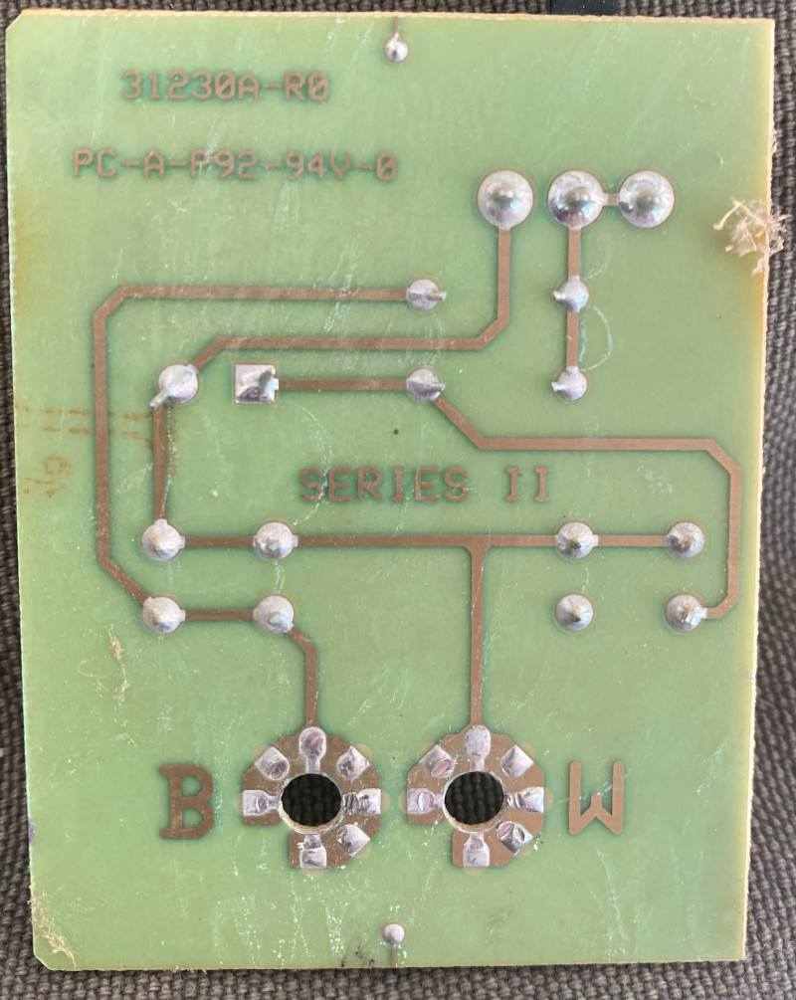

+++
title = "Genie GPS1200IC automation with ESP8266"
date = "2021-05-03"
categories = [ "home automation" ]
tags = ["esphome", "esp8266"]
+++

My garage has two doors. I'd like to be able to say "Open the garage door" to Siri.

To get there, I'm going to try using Home Assistant and ESPHome.
First, though, I need to know how to tell the garage door to operate.

Both door openers are Genie GPS1200IC. Based on some brief research, these appear to have been made between 1996-2000.

## Hack a remote?

My first attempt was to buy a remote and hook a microcontroller to it.
I bought a Genie GITR-3 remote. This remote has 3 buttons.
The plan was to wire an ESP8266 to the buttons of this remote.

Unfortunately, this remote doesn't work correctly on my garage doors.
In the manual, this remote says "For models made prior to 1996, only the right-most button works"

Welp. 
Turns out, only the right-most button works on my garage doors. 
I have two doors, and spending another $30 for _another_ remote for this project doesn't feel that great.

## Hack the wall buttons?

On the wall of my garage are your typical garage door open buttons. These panels are typically wired directly to the garage motor controller on the garage ceiling.

My panel has two buttons.
Pulling the panel apart shows a very simple circuit.
Two buttons, two resistors, one LED, and a switch.

Making some guesses and measurements, this seems to use some kind of voltage
division circuit. I'm not well-trained on electronics, but I'm assuming the
second resistor in the voltage divider is inside the garage opener motor
itself. Anyway, the voltage changes depending on the state of the buttons.

The "door" button uses an 82.5ohm resistor. I didn't have any of those, so I
tried a few different ones. Shorting the garage opener contacts with a 47ohm
resistor does indeed open the door. Using a 480ohm resistor will toggle the light on the garage door opener.
